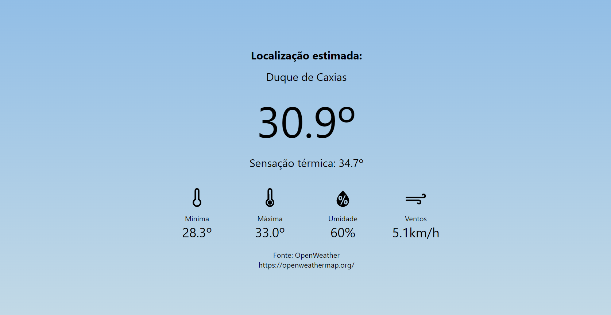
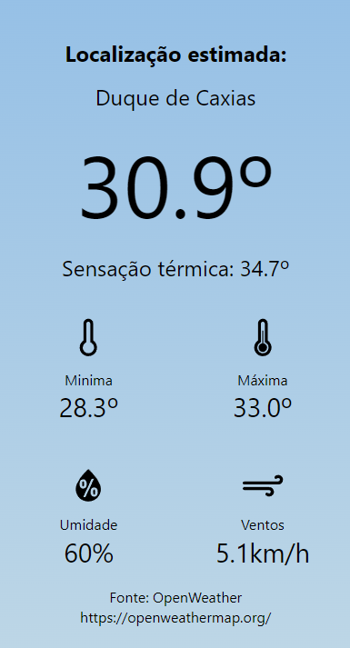

<h1> REACT WEATHER </h1>

<h3>Descrição do projeto</h3>

 App de previsão de tempo, utilizando Axios para requisição de API externa, useState, useEffect e Geolocation. 

<h3>Acesse o projeto</h3><a href="https://gustavocrs.github.io/tempo/">Clique Aqui</a> 

<h3>Linguagens</h3>

<h3>Autor</h3> Gustavo Silva 

<h3>Adaptação</h3> Gustavo Silva

<h3>Imagens do projeto</h3>

